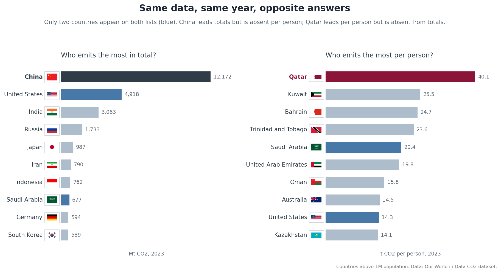

# energy-carbon-forecast-ml

One-year-ahead forecasting of country CO2 emissions from the official Our World in Data (OWID) dataset, benchmarked honestly against simple baselines.

**Status: modeling complete, interpretation in progress.** Sessions 1-5 (framing and EDA, feature engineering, baselines, Ridge and tree models, XGBoost with the single test evaluation) are complete. Error analysis (Session 6) and the final reproducibility pass (Session 7) remain. Every metric claimed here exists in `results/model_comparison.csv`, written by the clean-run script `src/train.py`.

## The question

Using information available through year *t*, how accurately can we predict a country's production-based CO2 emissions in year *t+1*, and does machine learning beat simple historical baselines?

The honest benchmark matters more than the model: country emissions change slowly (median absolute year-over-year change since 2010 is about 4.4 percent of the level), so persistence, predicting that next year equals this year, is a strong opponent. Every model here is reported with a skill score against persistence, computed on identical rows. A model that loses to persistence will be reported as losing.

## Scope

The current target is production-based annual CO2 (Mt) per country, one year ahead. Energy variables (primary energy consumption and related columns) are used as candidate features; forecasting energy as a second target is a planned extension, gated until the core CO2 result is reproducible. The name of the repository reflects the intended full arc, not the current deliverable.

This is a statistical extrapolation portfolio project using historical public data. It is not a causal model, a policy forecast, or an energy-system scenario.

## Data

Official OWID CO2 dataset: about 50,000 country-year rows, 79 columns, 1750-2024. The raw CSV is not committed; retrieval instructions and the codebook are in `data/`. Entity filtering (218 ISO-coded countries kept; aggregates such as World and Asia excluded, plus documented edge cases like Kosovo and the Kuwaiti Oil Fires record) is described in `data/README.md`.

## Method summary

- Chronological validation, never random row splits: train through 2014, validation 2015-2018, headline test 2019-2023. 2024 targets are reported separately as provisional, since the newest OWID release year is revisable.
- Features for predicting year *t+1* use data through year *t* only; all lags and rolling statistics are computed within country.
- Baselines: persistence and recent linear trend. Models: Ridge, histogram gradient boosting, XGBoost.
- Metrics: MAE, RMSE, persistence skill score, plus scale-aware breakdowns (the top five emitters account for roughly 62 percent of global CO2, so a single overall MAE would be dominated by giants).

## Headline result (Session 5, the single test evaluation)

All eight models were scored once on the held-out test years (targets 2019-2023, 762 country-year rows, identical rows for every model), after hyperparameters and tree counts were frozen on validation and expectations were pre-registered in writing. The window deliberately includes the 2020 COVID disruption.

| model | test MAE | test RMSE | MedianAE | skill vs persistence |
|---|---|---|---|---|
| xgb_delta | 9.345 | 33.009 | 1.486 | +0.151 |
| linear_trend | 9.751 | 35.064 | 1.450 | +0.114 |
| hgb_delta | 10.369 | 39.921 | 1.419 | +0.058 |
| ridge_level | 10.578 | 34.484 | 2.194 | +0.039 |
| ridge_delta | 10.603 | 34.598 | 2.219 | +0.036 |
| persistence | 11.004 | 43.971 | 1.367 | 0.000 |
| hgb_level | 22.479 | 160.414 | 1.491 | -1.043 |
| xgb_level | 31.181 | 272.674 | 1.616 | -1.834 |

The honest one-sentence summary: XGBoost predicting year-over-year changes beat persistence by about 15 percent on test MAE, but a country-clustered bootstrap (95 percent interval [-0.018, +0.271], p = 0.14) cannot rule out that the gap is sampling noise, and for the typical country (median absolute error, median percentage error) persistence remained the best forecast.

Three further findings the table supports:

- Parameterization mattered more than algorithm. Models predicting the year-over-year change (delta) and reconstructing the level consistently beat their level-predicting twins; the level tree models failed severely (skill -1.0 to -1.8), which is consistent with trees being unable to extrapolate a rising level past their training ceiling. The only statistically distinguishable test result is xgb_level losing to persistence (p = 0.005).
- The window decides the winner. On the calm validation years (2015-2018), persistence ranked second and only xgb_delta beat it; on the disrupted test years, five models passed persistence, which suggests the no-change forecast suffers most when large year-over-year changes arrive. On the separate provisional 2024 table (a calm year, revisable data), persistence is best again.
- Overall MAE and typical-country error rank models differently. Persistence keeps the best MedianAE and MdAPE on test while ranking sixth on MAE; the ML gains appear concentrated in large, volatile rows. Session 6 decomposes this by country, year, and emitter size.

Frozen configurations, both taken as the validation-grid winners before the test ran: xgb_level (max_depth 6, learning_rate 0.10, 125 trees), xgb_delta (max_depth 3, learning_rate 0.10, 173 trees); Ridge alpha 0.1 and the HistGB settings were frozen in Session 4. Reproduce the full table with `python src/train.py` in the pinned environment (`requirements.txt`). The mathematical foundations, including the XGBoost second-order derivation and the clustered-bootstrap inference, are in `math/main.pdf`.

## Findings so far (Session 1, EDA)

Total and per-capita emissions produce almost disjoint top-10 lists; only Saudi Arabia and the United States appear on both. The same denominator choice will shape how model errors are judged across country sizes.

Full exploratory analysis: `notebooks/01_framing_eda.ipynb` and `notebooks/01b_visual_eda.ipynb`, with all figures in `results/figures/`.

## Repository notes

This project is built in a documented human-plus-AI workflow. The agent context files (`CLAUDE.md`, `AGENTS.md`, the execution and learning plans, and the recorded check questions) are committed deliberately as part of the method: they contain the locked modeling decisions, the leakage rules, and the session-by-session record of what was decided and why.

## Author

Dr. Khawar Naeem, Qatar Transportation and Traffic Safety Center (QTTSC), Qatar University.

## References

Our World in Data CO2 dataset repository: https://github.com/owid/co2-data

OWID CO2 codebook: https://raw.githubusercontent.com/owid/co2-data/master/owid-co2-codebook.csv

Scikit-learn lagged-feature forecasting example: https://scikit-learn.org/stable/auto_examples/applications/plot_time_series_lagged_features.html

XGBoost documentation: https://xgboost.readthedocs.io/en/stable/
